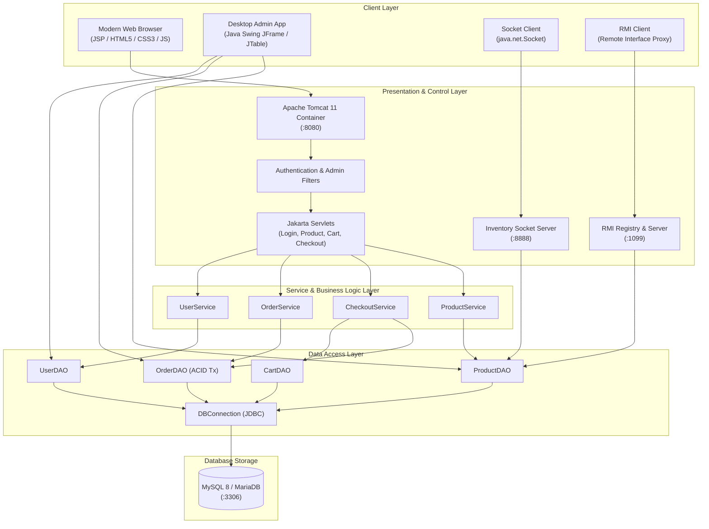
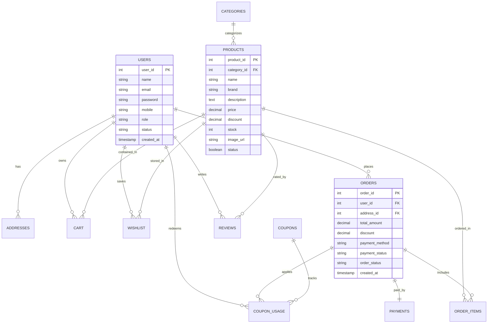
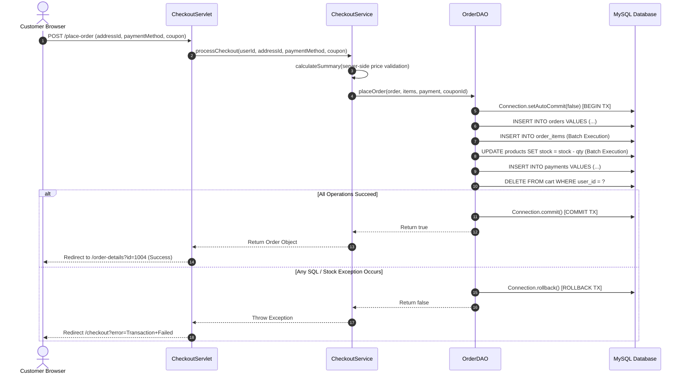

# SHOPSPHERE: Java Enterprise E-Commerce Management System
## Final Capstone Laboratory & Project Examination Report
**Course:** Advanced Java Laboratory (RTU Computer Science & Engineering)  
**Academic Session:** 2025–2026  
**System Architecture:** N-Tier Enterprise Distributed Architecture  

---

## 1. Introduction
ShopSphere is a full-featured, distributed enterprise E-Commerce management application built using the Java programming language and Jakarta EE standards. It is engineered to satisfy the theoretical and practical requirements of the Rajasthan Technical University (RTU) Advanced Java syllabus.

The project incorporates:
1. **Jakarta Servlets and JavaServer Pages (JSP)** on **Apache Tomcat 11** for the web customer storefront and admin dashboard.
2. **Java Swing** for an administrative desktop application adhering to desktop MVC patterns.
3. **JDBC and MySQL** for persistent transactional database storage with full ACID compliance.
4. **java.net Networking** for multithreaded client-server communication using Java Sockets.
5. **Java Remote Method Invocation (RMI)** for distributed remote inventory synchronization.
6. **Object Serialization** for network data interchange.

---

## 2. Problem Statement
Modern E-Commerce architectures demand high availability, modularity, secure transactional operations, and seamless interoperability between web clients, desktop back-office applications, and distributed microservices. Traditional academic projects often present these concepts in isolation. ShopSphere addresses this by integrating web controllers, desktop UIs, TCP sockets, and RMI into one unified application with a shared data model and business logic layer.

---

## 3. Project Objectives
- Build a modular E-Commerce application using Java layered MVC architecture.
- Develop a desktop administration module using Java Swing and Pluggable Look and Feel.
- Implement transactional persistence using MySQL Connector/J and JDBC `PreparedStatement`.
- Build a custom multithreaded inventory server using `ServerSocket` and `Socket`.
- Establish a distributed inventory service using Java RMI and the RMI Registry (`rmiregistry`).
- Implement Jakarta Servlet 6.1 controllers, `HttpSession`, cookies, request filters, and context listeners.
- Utilize JSP 3.1 Expression Language (EL), JSTL (Core, XML, Functions), JSP Fragments, and Custom Tag Extensions.
- Implement Internationalization (I18N) using Java `ResourceBundle` and `Locale`.

---

## 4. Technology Stack

| Layer | Component | Specification |
| :--- | :--- | :--- |
| **Language** | Java Development Kit | OpenJDK 25 (Adoptium Temurin) |
| **Web Container** | Web Application Server | Apache Tomcat 11.0.26 |
| **Server Technologies** | Jakarta EE Specifications | Jakarta Servlet 6.1.0, Jakarta JSP 3.1.0 |
| **View Template** | Dynamic Web Views | JSP 3.1 + EL + JSTL 3.0 + Custom Tag Files & TLD |
| **Frontend Styling** | UI Framework & Typography | Bootstrap 5.3.3, Bootstrap Icons, Plus Jakarta Sans |
| **Database** | Relational Database | MySQL 8.x / MariaDB 10.4 |
| **Database Access** | Persistence API | JDBC (MySQL Connector/J 8.3.0) |
| **Desktop Application** | GUI Toolkit | Java Swing + AWT (System Look & Feel) |
| **Distributed Computing**| Remote Objects | Java RMI (Registry port 1099) |
| **Socket Networking** | Transport Layer | java.net Socket / ServerSocket (Port 8888) |
| **Build Automation** | Build & Packaging Tool | Apache Maven 3.9.16 (Multi-module) |

---

## 5. System Architecture

---

## 6. Database Schema & ER Diagram

---

## 7. Order Placement Sequence Diagram (ACID Transaction)

---

## 8. RTU Syllabus-to-Code Mapping Reference

| Topic | Primary Files | Educational Demonstration Details |
| :--- | :--- | :--- |
| **Swing & Components** | `LoginFrame.java`, `AdminDashboard.java` | JFrame, JPanel, JTable, DefaultTableModel, JScrollPane, JComboBox, JTextField, JPasswordField, JOptionPane |
| **Pluggable Look & Feel** | `SwingAdminApp.java` | `UIManager.setLookAndFeel(UIManager.getSystemLookAndFeelClassName())` |
| **Web MVC Architecture** | `controller/`, `service/`, `dao/`, `model/` | Layered segregation: Web views never interact directly with database |
| **Applet Concept** | `syllabus-demo.jsp` | Emulates browser Applet lifecycle (`init`, `start`, `stop`, `destroy`, `paint`) on HTML5 canvas |
| **JDBC Persistence** | `DBConnection.java`, DAOs | Parameterized `PreparedStatement`, `ResultSet`, driver registration |
| **ACID Transactions** | `OrderDAO.java` | Atomic multi-table checkout commit/rollback guarantee |
| **java.net Networking** | `InventorySocketServer.java`, `InventorySocketClient.java` | Multithreaded `ServerSocket.accept()`, `Socket` streaming on port 8888 |
| **Object Serialization** | `NetworkMessage.java`, `Product.java` | Implements `Serializable` with `serialVersionUID`, transmitted via `ObjectOutputStream` |
| **Java RMI & Registry** | `InventoryService.java`, `RmiServer.java`, `RmiClient.java` | Remote interface extending `Remote`, `UnicastRemoteObject`, `rmiregistry` lookup on port 1099 |
| **Naming / JNDI** | `JndiDemoUtil.java`, `syllabus-demo.jsp` | Demonstrates `javax.naming.InitialContext` resource resolution |
| **I18N / L10N** | `messages_en.properties`, `messages_hi.properties` | Dynamic language switching via `ResourceBundle` and `Locale` |
| **Servlet Lifecycle** | `LoginServlet.java` | Override of `init(ServletConfig)`, `service()`, `doGet()`, `doPost()`, `destroy()` |
| **Filters & Interception** | `AuthenticationFilter.java`, `AdminFilter.java` | Route protection for customer endpoints and `/admin/*` role validation |
| **Application Events** | `AppListener.java` | `@WebListener` tracking `ServletContext` and active `HttpSession` telemetry |
| **JSP Elements** | `syllabus-demo.jsp` | Syntax demonstration of `<%! %>`, `<% %>`, `<%= %>`, `<%-- --%>` |
| **Tag Files & TLD** | `productCard.tag`, `rating.tag`, `shopsphere.tld`, `RatingTag.java` | Classic Tag Extension and modern Tag File components |
| **JSTL Core, XML, fn** | `products.jsp`, `syllabus-demo.jsp` | Core tags (`c:forEach`, `c:if`), XML tags (`x:parse`, `x:out`), Functions (`fn:length`) |

---

## 9. Conclusion
ShopSphere successfully proves that complex, distributed enterprise Java concepts can be seamlessly united into a single, cohesive, modern E-Commerce software application. It serves as an exemplary RTU Advanced Java Capstone Project ready for viva examination and academic defense.
